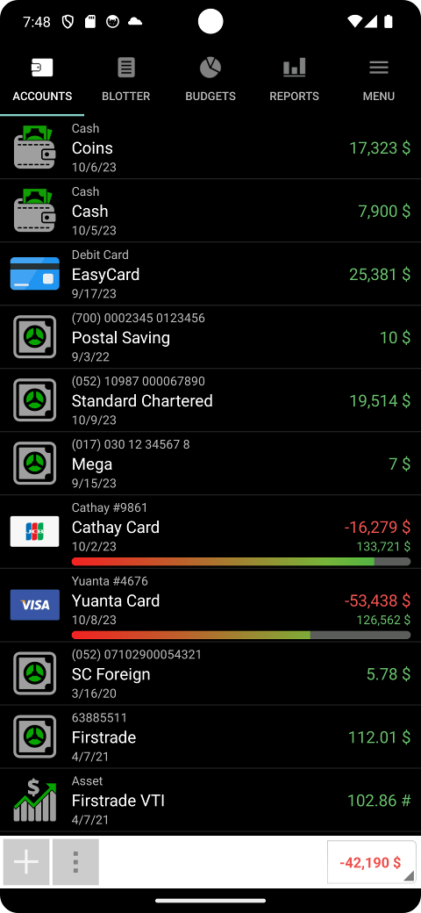
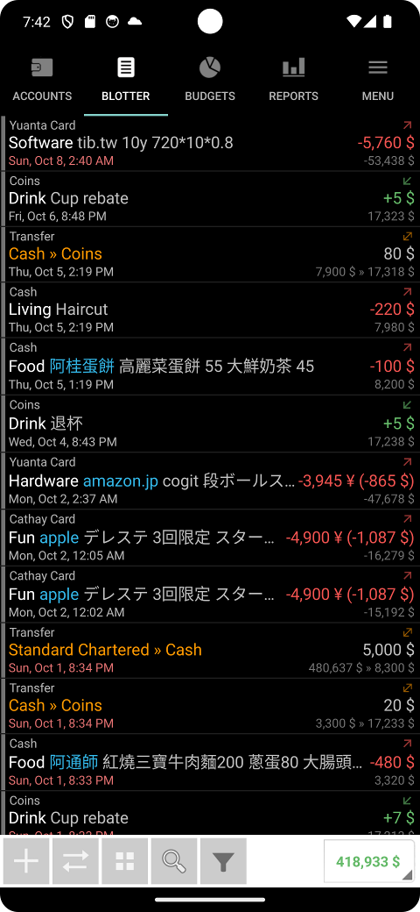
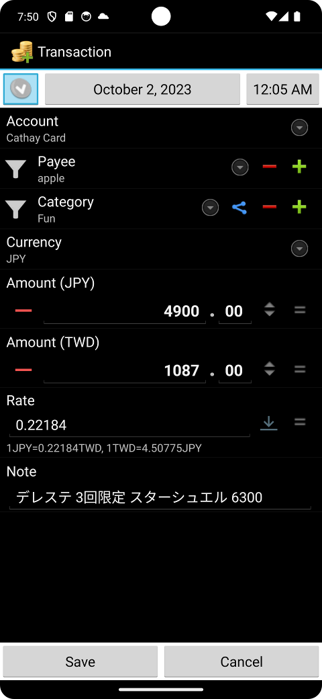
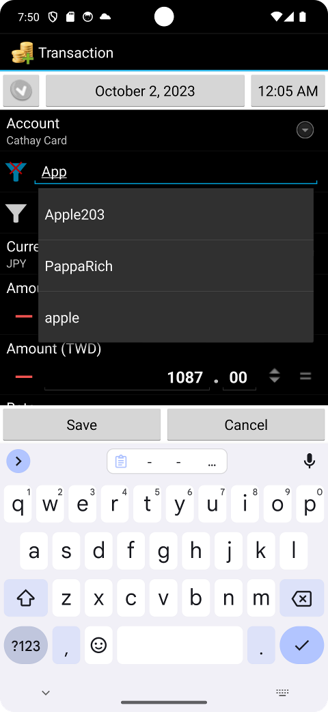

# Financisto Holo

Get it on Google Play: https://play.google.com/store/apps/details?id=io.github.mpstudios56.cifra

Please see https://github.com/dsolonenko/financisto for latest development by 
orginal author.

This codebase is started from an imported copy of an old version of source code 
at launchpad (https://code.launchpad.net/~financisto-dev/financisto/trunk), as 
an working interim version until proper version 2 comes out.

Old-school, no cloud, no online service. Everything is on your device, unless you explicitly enables
Google Drive and/or Dropbox online backup. I used it for 12+ years but it stopped updated a while ago,
tweaked some quirks to fit my own needs. Hope it helps you too!

BE SURE TO BACKUP YOUR DATA!

* Holo/Material theme (only partial update to Material due to class hierarchy difficult to upgrade ...)
* Date/time picker provided by new Android versions
* Tweaked text layout, support device text scaling
* Search memo text, amount value (even with range)
* Location removed due to huge change in google maps API
* Photo removed due to backup and content linking/updating difficulties
* Backup file compatible with Play store version 1.7.1
* SMS template has been changed to Notification template, supporting other apps' push notification

I have some example scripts that can:

* Exporting Financisto backup files to hledger text format (for easy human read, searching in editor)
* Creating transactions from Taiwan EasyCard
* Importing transaction logs from Taiwan Government Unified Invoice

Find them at: https://github.com/tiberiusteng/financisto-backup-to-hledger

---

## Third-party artwork

Seventeen of the category symbols in `app/src/main/res/drawable/category_*.xml`
are drawn on geometry from [Tabler Icons](https://tabler.io/icons), MIT licence,
copyright (c) 2020-2024 Paweł Kuna. Each of those files says so in its header.
The MIT licence text travels with them:

> Permission is hereby granted, free of charge, to any person obtaining a copy
> of this software and associated documentation files (the "Software"), to deal
> in the Software without restriction, including without limitation the rights
> to use, copy, modify, merge, publish, distribute, sublicense, and/or sell
> copies of the Software, and to permit persons to whom the Software is
> furnished to do so, subject to the following conditions:
>
> The above copyright notice and this permission notice shall be included in all
> copies or substantial portions of the Software.
>
> THE SOFTWARE IS PROVIDED "AS IS", WITHOUT WARRANTY OF ANY KIND, EXPRESS OR
> IMPLIED, INCLUDING BUT NOT LIMITED TO THE WARRANTIES OF MERCHANTABILITY,
> FITNESS FOR A PARTICULAR PURPOSE AND NONINFRINGEMENT. IN NO EVENT SHALL THE
> AUTHORS OR COPYRIGHT HOLDERS BE LIABLE FOR ANY CLAIM, DAMAGES OR OTHER
> LIABILITY, WHETHER IN AN ACTION OF CONTRACT, TORT OR OTHERWISE, ARISING FROM,
> OUT OF OR IN CONNECTION WITH THE SOFTWARE OR THE USE OR OTHER DEALINGS IN THE
> SOFTWARE.
